<div align="center">

# skyfusion — Station and NASA POWER Fusion for Hourly Temperature Forecasts

**skyfusion is a forecasting pipeline for weather analysts who combine a ground station with NASA POWER data. It takes the two raw sources through these steps to scored forecasts for the next 1 to 24 hours:**

`load in UTC` → `check and fuse like-for-like` → `direct multi-horizon samples` → `baselines and models` → `skill and ablation`.


**[Summary](#1-summary)** ·
**[Workflow](#4-the-end-to-end-workflow)** ·
**[Run it](#10-how-to-run-skyfusion)** ·
**[Configuration](#104-environment-variables)** ·
**[Known problems](#13-known-problems)** ·
**[Glossary](#15-glossary)**

</div>

> [!NOTE]
> This README uses ASD-STE100 Simplified Technical English. The writing rules and the project
> vocabulary are in [`docs/ste-style-guide.md`](docs/ste-style-guide.md). Each term in the
> [Glossary](#15-glossary) has only one meaning.

---

skyfusion forecasts the observed station temperature for each of the next 24 hours.
It puts the station data and the NASA POWER data on one UTC grid.
It averages two columns only when they measure the same quantity.
One model call gives all 24 horizons, so no prediction goes back into the inputs.
Each model is compared with persistence, and the station-only and fused feature sets are compared on identical samples.

This README is the **one location that explains all of skyfusion**. It gives these topics:

- the general design
- each component and its procedure, step by step
- the decision rules
- the data map
- the runbook
- the validation results and the known problems

| If you are… | Read |
|---|---|
| A manager or reviewer | [1](#1-summary), [3](#3-design-rules), [4](#4-the-end-to-end-workflow), [12](#12-validation-results), [14](#14-key-points) |
| A developer who joins the project | All sections, in sequence. Keep [10](#10-how-to-run-skyfusion) and [13](#13-known-problems) open while you work |
| An operator who runs skyfusion | [10](#10-how-to-run-skyfusion), then the section for the component that you use |

---

## Table of contents

1. 🧭 [Summary](#1-summary)
2. 🏗️ [How skyfusion is built](#2-how-skyfusion-is-built)
   - 2.1 [Components](#21-components)
   - 2.2 [System context](#22-system-context)
   - 2.3 [Repository layout](#23-repository-layout)
3. 🛡️ [Design rules](#3-design-rules)
4. 🔄 [The end-to-end workflow](#4-the-end-to-end-workflow)
   - 4.1 [Full flow](#41-full-flow)
   - 4.2 [The life cycle of one forecast](#42-the-life-cycle-of-one-forecast)
   - 4.3 [Who does which step](#43-who-does-which-step)
5. 🔵 [Ingestion and UTC alignment](#5-ingestion-and-utc-alignment)
6. 🟢 [Quality control and fusion](#6-quality-control-and-fusion)
7. 🟣 [Samples, split and models](#7-samples-split-and-models)
8. ⚖️ [The decision rules](#8-the-decision-rules)
9. 🗂️ [Data and file map](#9-data-and-file-map)
10. ▶️ [How to run skyfusion](#10-how-to-run-skyfusion)
    - 10.1 [Prerequisites](#101-prerequisites) · 10.2 [Installation](#102-installation) · 10.3 [Run skyfusion](#103-run-skyfusion) · 10.4 [Environment variables](#104-environment-variables)
11. 🧩 [How to extend skyfusion](#11-how-to-extend-skyfusion)
12. ✅ [Validation results](#12-validation-results)
13. ⚠️ [Known problems](#13-known-problems)
14. 📌 [Key points](#14-key-points)
15. 📖 [Glossary](#15-glossary)
16. 📄 [License](#16-license)

---

## 1. Summary

**The problem.** A ground station and NASA POWER describe the same site, but they use different times, units and quantities. These questions are difficult:

- How do you align a UTC station file and a POWER file in local standard time?
- Which columns can you average, and which columns only look similar?
- What do you do with the POWER fill value `-999`?
- How do you forecast many hours ahead without a recursive loop that feeds errors back?
- Does the second source improve the forecast, compared with persistence and on the same target?

skyfusion gives each of these questions its own component. Each component has unit tests.

| Item | Value |
|---|---|
| Input | OpenWeather History Bulk CSV (station) and NASA POWER hourly CSV or API data |
| Output | A UTC hourly table, MAE, RMSE and skill for each horizon, an ablation with intervals, a 24-hour forecast |
| Components | **9** modules: config, ingest, fuse, synthetic, windows, models, lstm, evaluate, cli |
| Providers | NASA POWER API (optional download), PyTorch (optional LSTM) |
| Offline mode | Synthetic files in both raw formats, all loaders, all baselines, ridge and boosting |
| Safety | One UTC index. The target is never averaged and never filled. No sample crosses a split boundary |
| Tests | **25** pass in CI (`.[dev]` only) and 1 skips (`lstm` extra). With the `lstm` extra, all 26 pass |

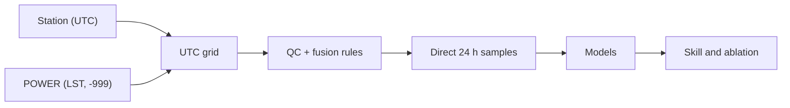

---

## 2. How skyfusion is built

### 2.1 Components

| Component | Module | Purpose |
|---|---|---|
| Settings | `src/skyfusion/config.py` | Site, split years, window, horizon, seed |
| Ingestion | `src/skyfusion/ingest.py` | POWER parser (LST to UTC, -999 to NaN), POWER API client with cache, OpenWeather parser |
| Fusion | `src/skyfusion/fuse.py` | UTC grid, quality control, fusion rules, forward fill, mask columns |
| Synthetic data | `src/skyfusion/synthetic.py` | One hidden truth written in both raw file formats |
| Samples | `src/skyfusion/windows.py` | Direct multi-horizon samples, split by year with an embargo |
| Models | `src/skyfusion/models.py` | Persistence, seasonal naive, climatology, ridge, gradient boosting |
| LSTM | `src/skyfusion/lstm.py` | Optional direct multi-horizon LSTM with early stopping |
| Evaluation | `src/skyfusion/evaluate.py` | MAE, RMSE, skill, ablation with a day-block bootstrap |
| CLI | `src/skyfusion/cli.py` | The `skyfusion` command with 6 subcommands |

The component map shows which module calls which module. An arrow points from the caller to the module that it uses.

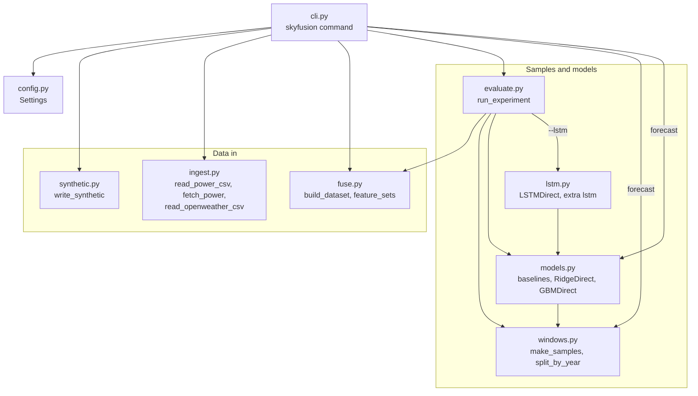

### 2.2 System context

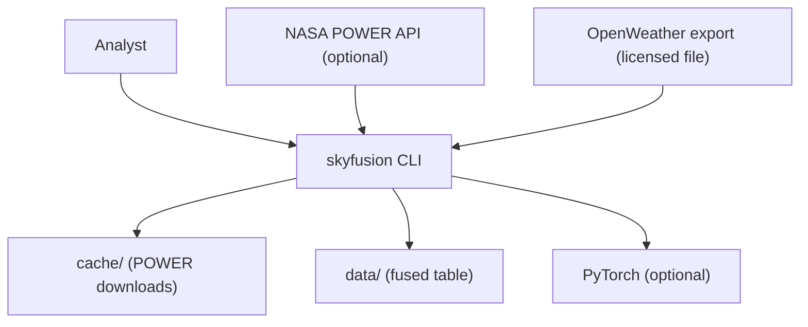

### 2.3 Repository layout

```
skyfusion/
├── .github/workflows/ci.yml   # CI: Python 3.11, pip install -e ".[dev]", pytest -q
├── data/README.md             # sources, terms, columns (data files are git-ignored)
├── docs/ste-style-guide.md    # writing rules and project vocabulary
├── src/skyfusion/             # the 9 modules in 2.1
├── tests/                     # 26 unit tests (1 needs the lstm extra), synthetic data only
├── .env.example               # variable names only
└── pyproject.toml             # core deps: numpy, pandas, scikit-learn, pydantic. Extras: lstm, dev
```

---

## 3. Design rules

### 3.1 One time standard: UTC
Each loader returns a timezone-aware UTC index. An LST POWER file is shifted by `round(lon / 15)` hours (−6 h at lon −97.04). `build_dataset` rejects a table without a UTC index. A test checks that the two temperatures agree best at lag 0, not at lag 6.

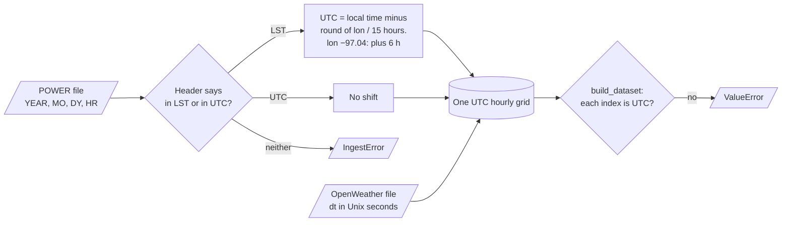

### 3.2 Fuse only the same quantity
Relative humidity at 2 m, precipitation and surface pressure can be averaged. Sea-level pressure and surface pressure are different, and wind at 10 m and wind at 2 m are different. These columns stay separate.

### 3.3 A fixed target
The target is the observed station temperature. It is never averaged with the POWER temperature, so the single-source and fused runs predict the same values.

### 3.4 No future values in a feature
A feature gap is filled only forward, for max 3 hours. A mask column records each gap. The target is never filled.

### 3.5 Direct forecasts for all horizons
For an origin t, the targets are t+1 to t+24 in one output. A test checks that target h of each sample is the observed temperature h hours after the origin.

### 3.6 Real validation and baselines first
The split is by year: train, validation and test. Ridge selects alpha, boosting selects its iteration count and the LSTM stops early on the validation years. Each model is scored against persistence.

### 3.7 Train-only preprocessing
Imputation and scaling are steps of an sklearn `Pipeline`, fit on the train samples. The LSTM computes its medians and scaling from the train samples.

---

## 4. The end-to-end workflow

### 4.1 Full flow

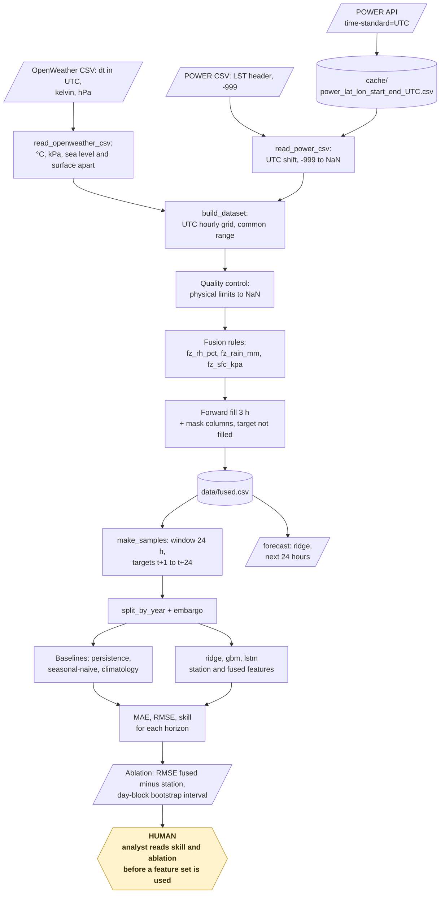

### 4.2 The life cycle of one forecast

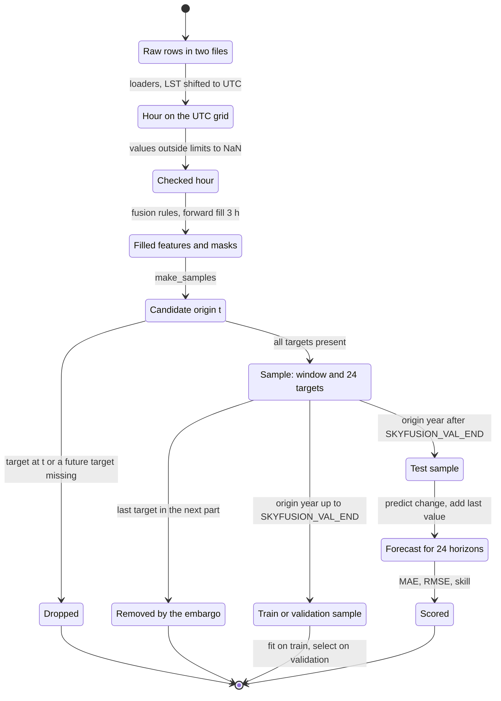

1. Read the station file and change kelvin to °C and hPa to kPa.
2. Read the POWER file, shift LST to UTC and change `-999` to NaN.
3. Put both tables on one hourly UTC grid.
4. Set values outside physical limits to NaN.
5. Average the like-for-like columns and fill feature gaps forward for max 3 hours.
6. Take the last 24 hours before the origin as the input window.
7. Predict the change from the last observed temperature for all 24 horizons.
8. Add the last observed temperature to get the forecast.

### 4.3 Who does which step

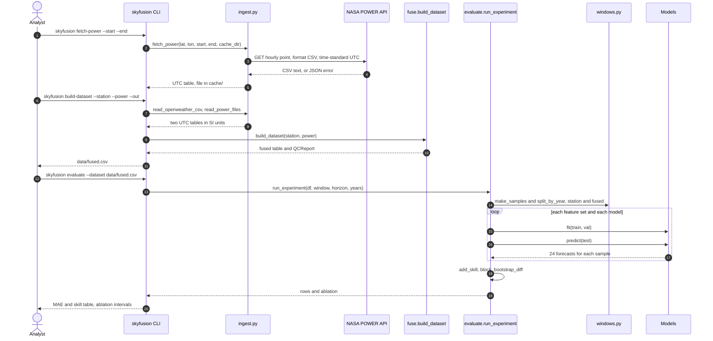

---

## 5. Ingestion and UTC alignment

**Purpose.** Read each source in its real format and return SI units on a UTC index.

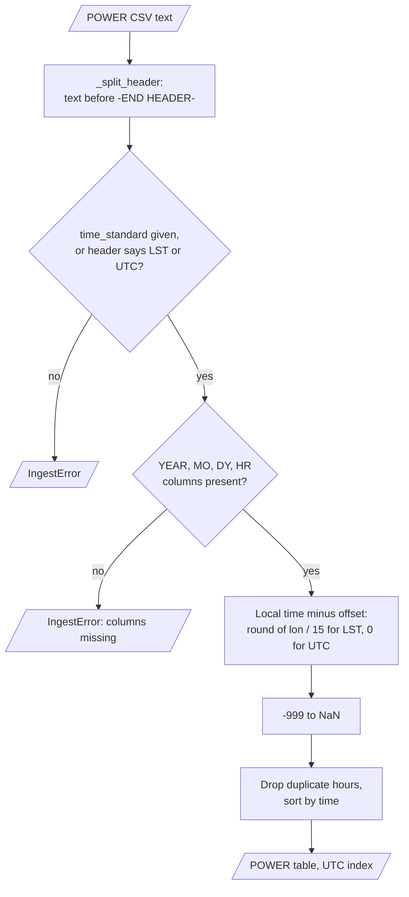

`fetch_power()` downloads one POWER request in UTC and keeps it in the cache.

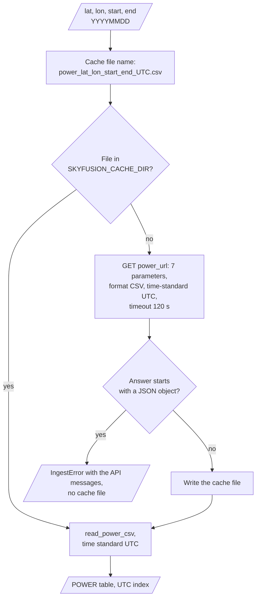

`read_openweather_csv()` changes the station export to SI units.

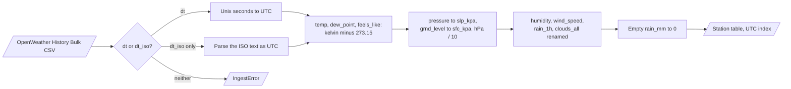

| Source | Time | Conversion |
|---|---|---|
| POWER file | `in LST` or `in UTC` from the header | LST − round(lon / 15) h → UTC. `-999` → NaN |
| POWER API | `time-standard=UTC` in the request | Cached as `cache/power_<lat>_<lon>_<start>_<end>_UTC.csv` |
| OpenWeather | `dt` in Unix seconds (UTC), else `dt_iso` | Kelvin → °C, hPa → kPa, empty `rain_1h` → 0 |

**Station columns after loading**

| Column | Meaning |
|---|---|
| `temp_c`, `dew_point_c`, `feels_like_c` | Temperatures. `feels_like` is a different quantity and is not mixed with `temp` |
| `slp_kpa` | Sea-level pressure (`pressure`) |
| `sfc_kpa` | Surface pressure (`grnd_level`), only if the export has it |
| `rh_pct`, `wind10_ms`, `rain_mm`, `clouds_pct` | Humidity, wind at 10 m, rain, cloud cover |

**Rules**

- If the POWER header says neither LST nor UTC, the loader stops with an error.
- A POWER API answer in JSON is an error message. The client raises it and writes nothing to the cache.

---

## 6. Quality control and fusion

**Purpose.** Make one clean table with the target, the features and the masks.

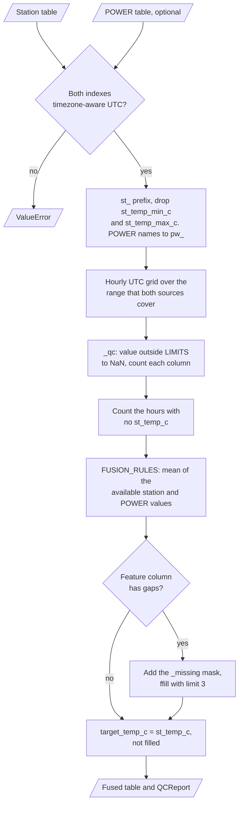

**Procedure**

1. Prefix the station columns with `st_` and the POWER columns with `pw_`.
2. Make an hourly UTC grid over the time range that both sources cover.
3. Set each value outside its physical limits to NaN and count it.
4. Make the fused columns of the fusion rules (mean of the available values).
5. For each feature column with gaps, add a `*_missing` mask and fill forward for max 3 hours.
6. Copy the unfilled `st_temp_c` to `target_temp_c`.

**Fusion rules**

| Fused column | Station column | POWER column | Why |
|---|---|---|---|
| `fz_rh_pct` | `st_rh_pct` | `pw_rh_pct` | Both are relative humidity near 2 m |
| `fz_rain_mm` | `st_rain_mm` | `pw_rain_mm` | Both are mm in one hour |
| `fz_sfc_kpa` | `st_sfc_kpa` | `pw_sfc_kpa` | Both are surface pressure. Only made if the station has `grnd_level` |

Not fused: `st_slp_kpa` with `pw_sfc_kpa` (sea level against surface), `st_wind10_ms` with `pw_wind2_ms` (10 m against 2 m), and `st_temp_c` with `pw_t2m_c` (the target).

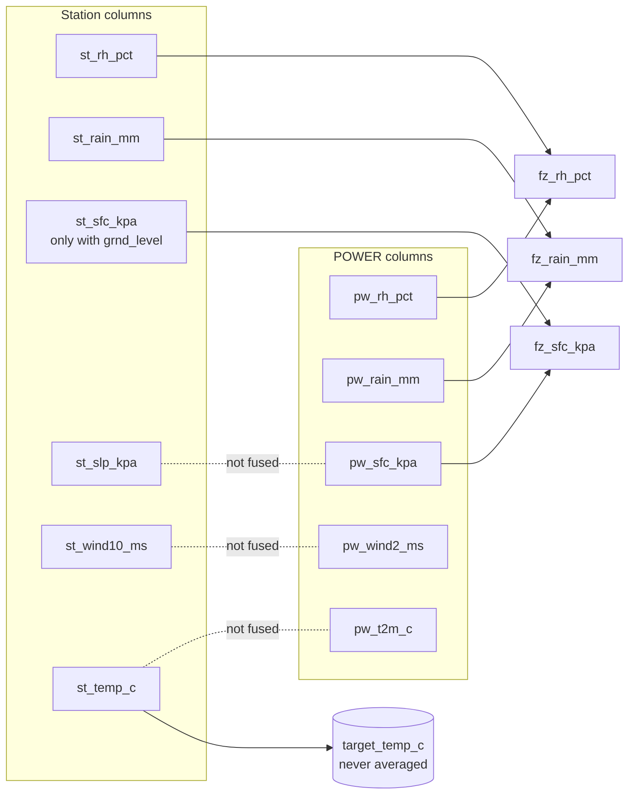

**Physical limits**

| Quantity | Limits |
|---|---|
| Temperature | −60 to 60 °C |
| Relative humidity | 0 to 100 % |
| Sea-level pressure | 85 to 110 kPa |
| Surface pressure | 50 to 110 kPa |
| Wind | 0 to 80 m/s |
| Rain | 0 to 300 mm/h |
| Shortwave and longwave irradiance | 0 to 1500 and 0 to 800 W/m² |

---

## 7. Samples, split and models

**Purpose.** Train and score models on samples that do not leak across time.

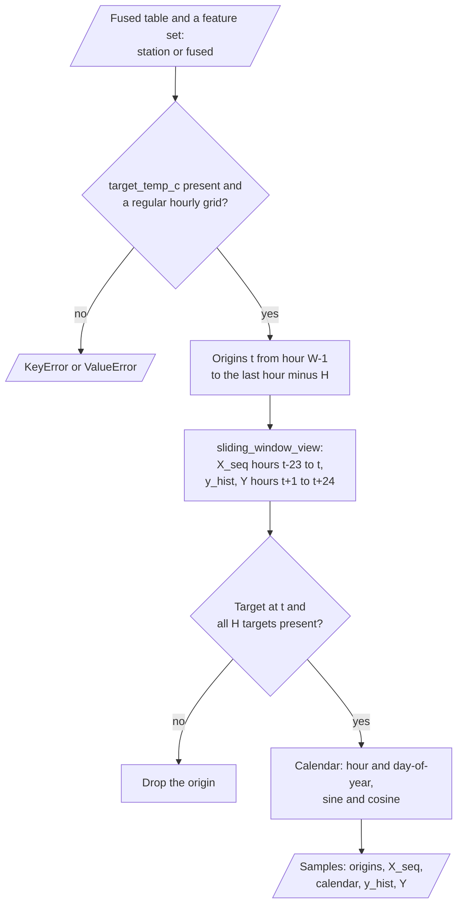

The diagram shows how `split_by_year()` puts each sample in one part.

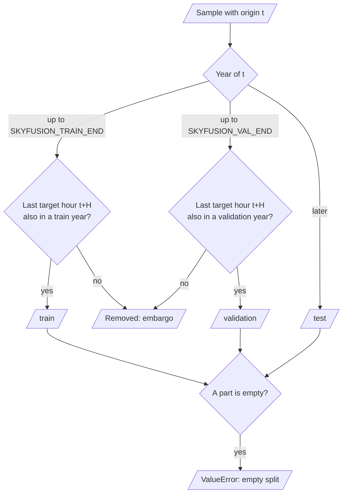

**Procedure**

1. For each origin t, take the window t−23 to t of the feature columns and the targets t+1 to t+24.
2. Keep a sample only if the target at t and all 24 targets exist.
3. Add hour-of-day and day-of-year sine and cosine values of the origin.
4. Put a sample in train, validation or test by the year of its origin.
5. Remove train and validation samples whose last target hour is in the next part (embargo).
6. Fit each model on train, select on validation, and score on test.

**Models**

| Model | Prediction | Selection on validation |
|---|---|---|
| `persistence` | Last observed temperature for all horizons | none |
| `seasonal-naive` | Temperature at the same hour on the day before | none |
| `climatology` | Train mean for each month and UTC hour | none |
| `ridge` | Change from the last value: imputer, scaler, ridge on the flat 24 h window | alpha ∈ {0.1, 1, 10, 100} |
| `gbm` | One histogram gradient boosting model for each horizon, last 6 hours of inputs | iteration count (max 150) |
| `lstm` | LSTM (64 units) with a linear head for all horizons, mask flags as extra inputs | early stopping, patience 4 |

The ablation trains `ridge`, `gbm` and `lstm` two times: with the `station` feature set and with the `fused` feature set. The samples, origins and targets are identical.

The learned models predict the change from the last observed temperature. Each one uses the validation samples in a different way.

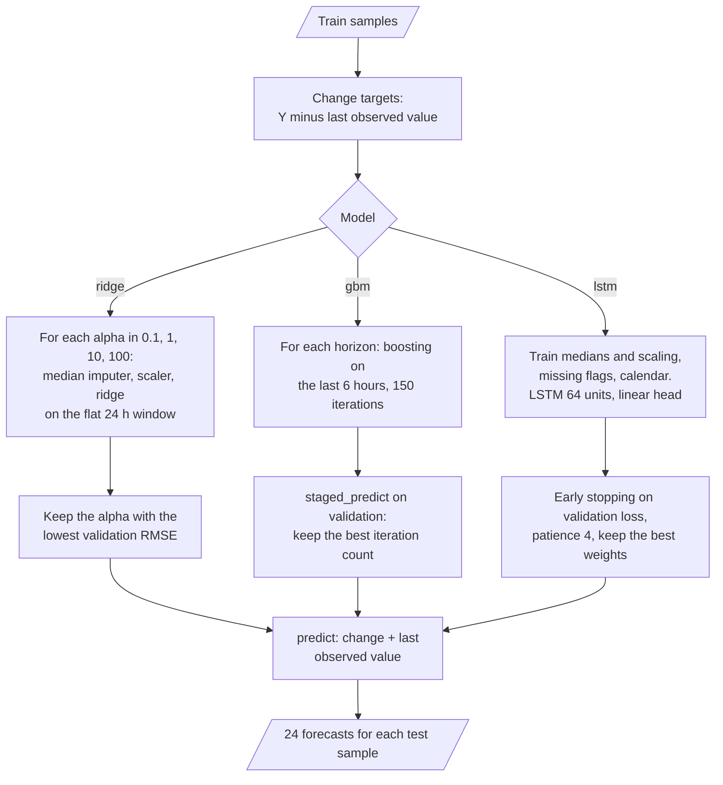

`run_experiment()` runs the comparison on the same test samples.

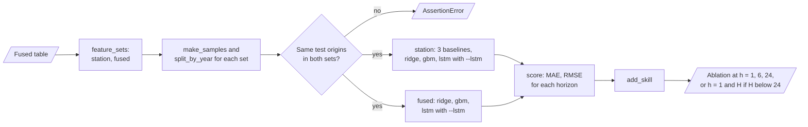

---

## 8. The decision rules

| Setting | Value | Where |
|---|---|---|
| Window | 24 hours (`SKYFUSION_WINDOW`) | `make_samples` |
| Horizon | 24 hours (`SKYFUSION_HORIZON`, max 72) | `make_samples` |
| Train years | up to `SKYFUSION_TRAIN_END` (default 2019) | `split_by_year` |
| Validation years | up to `SKYFUSION_VAL_END` (default 2021) | `split_by_year` |
| Test years | later than the validation years | `split_by_year` |
| Forward fill limit | 3 hours, features only | `build_dataset` |
| LST offset | round(lon / 15) hours | `Settings.lst_offset_hours`, `parse_power_text` |
| Skill | 1 − RMSE / RMSE of persistence, at each horizon | `evaluate.add_skill` |
| Ablation interval | 500 resamples of whole days, 95 % percentile | `block_bootstrap_diff` |

The diagram shows how skill and the ablation interval are calculated.

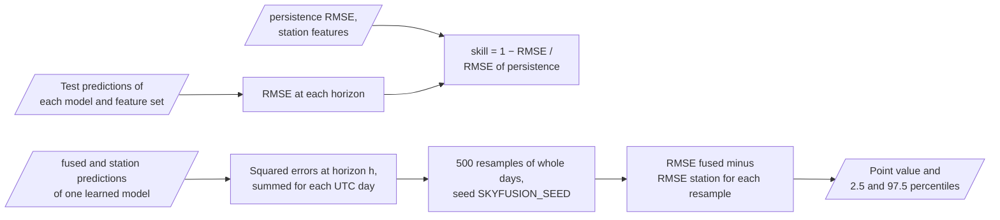

---

## 9. Data and file map

| Path | Committed? | Contents |
|---|---|---|
| `data/README.md` | Yes | Sources, terms, columns |
| `data/station_openweather.csv` | No (git ignores it) | Licensed station export |
| `data/synthetic/` | No (git ignores it) | Output of `skyfusion synth` |
| `data/fused.csv` | No (git ignores it) | Output of `skyfusion build-dataset` |
| `cache/` | No (git ignores it) | POWER downloads |
| `.env` | No (git ignores it) | Local settings |

---

## 10. How to run skyfusion

### 10.1 Prerequisites

| Need | For |
|---|---|
| Python 3.11+ | All components |
| Network access | `fetch-power` only |
| An OpenWeather History Bulk export | Real station data |
| Extra `lstm` | The LSTM (`evaluate --lstm`) |

### 10.2 Installation

```bash
git clone https://github.com/KrishnaAnnavaram/skyfusion.git
cd skyfusion
python -m venv .venv
. .venv/bin/activate            # Windows: .venv\Scripts\activate
pip install -e ".[dev]"
```

### 10.3 Run skyfusion

```bash
# Offline demo: synthetic station (UTC) and POWER (LST) files for 2018-2022
skyfusion synth --out data/synthetic
skyfusion qc --station data/synthetic/station_openweather.csv --power data/synthetic/power_lst.csv
skyfusion build-dataset --station data/synthetic/station_openweather.csv --power data/synthetic/power_lst.csv --out data/fused.csv
skyfusion evaluate --dataset data/fused.csv
skyfusion forecast --dataset data/fused.csv --fused

# Optional LSTM
pip install -e ".[lstm]"
skyfusion evaluate --dataset data/fused.csv --lstm

# Real data
skyfusion fetch-power --start 20010101 --end 20241231
skyfusion build-dataset --station data/station_openweather.csv --power cache/*.csv --out data/fused.csv
```

The diagram shows the order of the commands and the files that connect them.

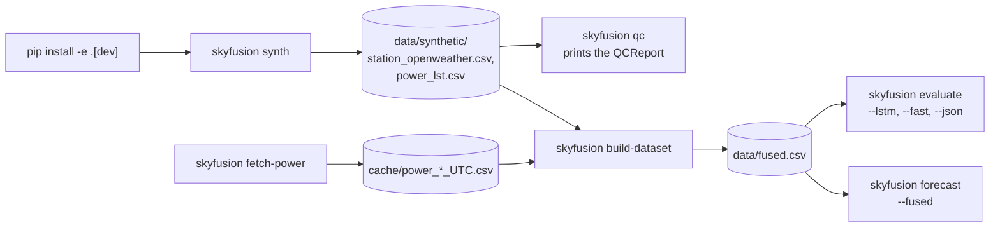

The `forecast` command makes one forecast from the last window of the table.

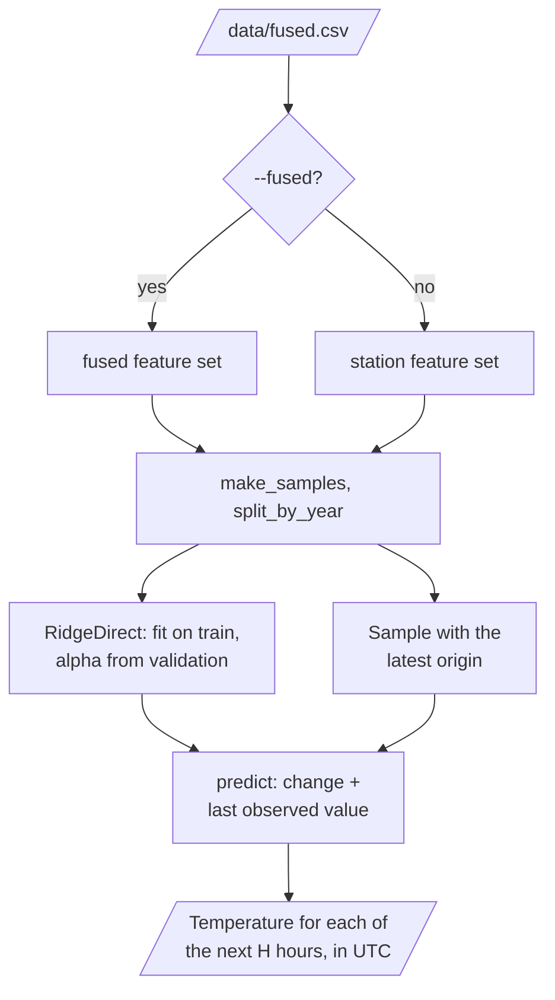

### 10.4 Environment variables

| Variable | Used by | Meaning |
|---|---|---|
| `SKYFUSION_LAT` | POWER client | Latitude, default 32.8998 |
| `SKYFUSION_LON` | POWER client, LST shift | Longitude, default −97.0403 |
| `SKYFUSION_CACHE_DIR` | POWER client | Cache folder, default `cache` |
| `SKYFUSION_TRAIN_END` | split | Last train year, default 2019 |
| `SKYFUSION_VAL_END` | split | Last validation year, default 2021 |
| `SKYFUSION_HORIZON` | samples | Hours ahead, default 24 |
| `SKYFUSION_WINDOW` | samples | Input hours, default 24 |
| `SKYFUSION_SEED` | models | Random seed, default 7 |

skyfusion needs no API key. Local settings are only in a `.env` file. Git ignores this file.

---

## 11. How to extend skyfusion

| You want to… | Do this | Code change? |
|---|---|---|
| Use another site | Set `SKYFUSION_LAT` and `SKYFUSION_LON`, run `fetch-power` | No |
| Change the split years | Set `SKYFUSION_TRAIN_END` and `SKYFUSION_VAL_END` | No |
| Add a fusion rule | Add a pair of the same quantity to `FUSION_RULES` | Small |
| Add a quality limit | Add an entry to `LIMITS` | Small |
| Add a model | Subclass `Model` with `fit(train, val)` and `predict(samples)` and add it to `default_models` | Small |

---

## 12. Validation results

All numbers come from synthetic data (2018 to 2022, one hidden truth). They are synthetic results, not results for a real site.

| Validation | Result | Command |
|---|---|---|
| Unit tests | CI installs only `.[dev]`: **25 passed**, 1 skipped (`lstm` extra, PyTorch). With the extras: 26 passed | `pytest -q` |
| UTC alignment | Station and POWER temperatures correlate best at lag 0 | `pytest tests/test_ingest_fuse.py` |
| Data | 43,824 hours, 549 hours without a station temperature (1 % random gaps and a 5-day outage) | `skyfusion build-dataset` |

**Test year 2022: 6,825 samples (train 2018-2019: 14,113, validation 2020-2021: 13,226). MAE in °C and skill**

| Model | Features | MAE h=1 | Skill h=1 | MAE h=6 | Skill h=6 | MAE h=24 | Skill h=24 |
|---|---|---|---|---|---|---|---|
| `persistence` | station | 0.839 | 0.000 | 3.984 | 0.000 | 1.318 | 0.000 |
| `seasonal-naive` | station | 1.323 | −0.656 | 1.366 | 0.622 | 1.318 | 0.000 |
| `climatology` | station | 2.584 | −2.173 | 2.570 | 0.312 | 2.572 | −0.913 |
| `ridge` | station | 0.456 | 0.432 | 0.996 | 0.732 | 1.239 | 0.065 |
| `gbm` | station | 0.462 | 0.428 | 1.001 | 0.729 | 1.276 | 0.031 |
| `lstm` | station | 0.458 | 0.430 | 0.923 | 0.750 | 1.251 | 0.055 |
| `ridge` | fused | **0.422** | **0.477** | 0.964 | 0.741 | **1.235** | **0.067** |
| `gbm` | fused | 0.435 | 0.460 | **0.869** | **0.753** | 1.263 | 0.043 |
| `lstm` | fused | 0.514 | 0.344 | 1.313 | 0.550 | 1.276 | 0.038 |

**Ablation: RMSE(fused) − RMSE(station), 95 % day-block bootstrap interval (negative means fusion helps)**

| Model | h=1 | h=6 | h=24 |
|---|---|---|---|
| `ridge` | −0.045 (−0.051 to −0.040) | −0.044 (−0.061 to −0.027) | −0.003 (−0.014 to +0.008) |
| `gbm` | −0.033 (−0.041 to −0.025) | −0.109 (−0.183 to −0.035) | −0.019 (−0.037 to +0.000) |
| `lstm` | +0.087 (+0.062 to +0.116) | +0.928 (+0.696 to +1.176) | +0.028 (+0.004 to +0.050) |

What the numbers show:

- The learned models beat persistence at every horizon. At 24 h, persistence equals the same hour yesterday, and the gain is small.
- POWER features improve ridge and boosting at 1 h and 6 h. The intervals do not include 0.
- The fused LSTM is worse. A possible cause: the last 60 days of the test year have POWER irradiance fill values, and the train years have none. Problem 3 in section 13 gives the action.
- The synthetic generator lets clouds, which only POWER sees, change the temperature some hours later. So the size of the fusion gain is a property of the generator.
- The prototype reported that fusion reduced the MSE from 0.91 to 0.24. That is a prototype result, not reproduced here, and it compared different targets.

---

## 13. Known problems

Read these problems before you use skyfusion in production.

| # | Area | Problem | Impact and action |
|---|---|---|---|
| 1 | Data | All results come from synthetic data | Run `fetch-power` and a real station export, then `evaluate` |
| 2 | Station | The real OpenWeather export is a licensed file and is not in the repository | Buy or export it for your site. See `data/README.md` |
| 3 | LSTM | Gaps that occur only in the test years confuse the LSTM | Add training samples with gaps (mask augmentation), or drop columns with long gaps |
| 4 | Timing | POWER reanalysis is published with a delay | For real-time use, use only features that exist at the forecast time |
| 5 | Target | Only temperature is forecast | Add humidity as a second target with the same code |
| 6 | Speed | Gradient boosting trains one model for each horizon | Use fewer horizons or `--fast` for quick checks |
| 7 | Sea-level pressure | The station gives only sea-level pressure in many exports | Surface pressure is then POWER only. No fused pressure is made |

---

## 14. Key points

1. **One UTC grid.** POWER LST is shifted, and a test checks the alignment at lag 0.
2. **Only like-for-like fusion.** Sea-level pressure, 10 m wind and the target are never averaged with POWER.
3. **No future values.** Features fill only forward, the target never, and an embargo separates the splits.
4. **Direct 24-hour forecasts.** Each horizon has its own scored output, with no recursive loop.
5. **Baselines and a fair ablation.** Skill is relative to persistence, and the two feature sets use identical samples.
6. **Everything runs offline.** The synthetic files use the real raw formats, and the 25 CI tests need no network.

---

## 15. Glossary

| Term | Meaning |
|---|---|
| **Station** | The OpenWeather observations of the site (`st_*` columns) |
| **POWER** | NASA POWER hourly data (`pw_*` columns) |
| **UTC grid** | The hourly UTC index that all columns share |
| **LST** | Local standard time of a POWER file, UTC + round(lon / 15) hours |
| **Fill value** | The POWER code `-999` for a missing value |
| **Fusion rule** | A pair of same-quantity columns that skyfusion averages |
| **Target** | The observed station temperature `target_temp_c` |
| **Mask column** | A `*_missing` column that is 1 where a value was missing |
| **Origin** | The last observed hour of a sample |
| **Window** | The input hours that end at the origin |
| **Horizon** | The number of hours after the origin |
| **Direct forecast** | One model output for all horizons |
| **Embargo** | The removal of samples whose targets cross into the next split part |
| **Baseline** | Persistence, seasonal naive or climatology |
| **Skill** | 1 − RMSE / RMSE of persistence |
| **Ablation** | The comparison of the station and fused feature sets on identical samples |
| **MAE** | Mean absolute error in °C |
| **RMSE** | Root mean squared error in °C |

---

## 16. License

[MIT](LICENSE) © 2026 Krishna Annavaram
